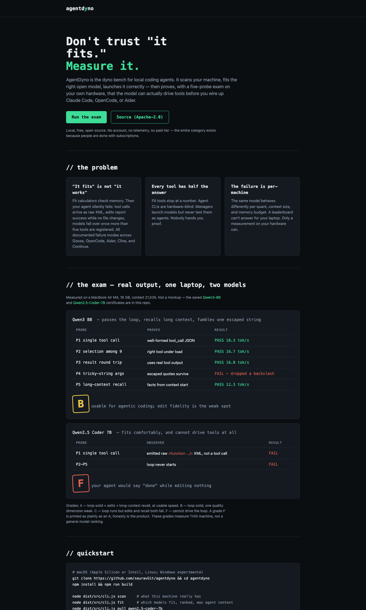

# AgentDyno

[](https://www.npmjs.com/package/agentdyno)
[](LICENSE)
[](package.json)

**Don't trust "it fits." Measure it.**

AgentDyno is the dyno bench for local coding agents. It scans your machine,
finds the open models that fit, launches them correctly — and then actually
proves, with a five-probe agentic exam on your own hardware, that a model can
drive tools before you wire [Goose](https://github.com/block/goose) or
[Cline](https://cline.bot) to it — the two open-source agents AgentDyno
battle-tests and treats as first-class citizens.

Local, free, Apache-2.0. No accounts, no telemetry, no paid tier.

<p align="center">
  
</p>

## Why

Fit calculators tell you a model fits in memory. Then you connect an agent and
it fails silently: tool calls come out as raw XML, the model picks the wrong
tool once more than five are registered, edits report success while no file
changes. Every one of those failure modes is documented across the ecosystem
(references in [`research/REPORT.md`](research/REPORT.md)). Memory fit is
necessary, not sufficient. AgentDyno measures the sufficient part.

New here? [**ONBOARDING.md**](ONBOARDING.md) walks through every command,
step by step, with real captured output, in about 15 minutes.

## Install

```sh
brew install sauravGit/agentdyno/agentdyno
```

```sh
npm install -g agentdyno
```

Both put a `dyno` binary on your `PATH`. Verify with `dyno --version`.

<details>
<summary>From source</summary>

```sh
git clone https://github.com/sauravGit/agentdyno && cd agentdyno
npm install && npm run build
node dist/src/cli.js --version
```
Use `node dist/src/cli.js <command>` in place of `dyno <command>` below, or
run `npm link` once to get the `dyno` binary from a source checkout too.
</details>

## Quickstart

```sh
dyno setup       # guided: pick UI or CLI, ends with a connected agent
```

`dyno setup` is the fast path: scan → pick a model → activate → run the exam
→ connect Goose / Cline (auto-launched in a new terminal) or install the
VS Code extension (which also installs the Goose + Cline CLIs and Cline's
own extension) — one flow instead of the manual steps below. It also detects
leftovers from a previous install and offers to clean them first
(`dyno clean` does the same thing directly, any time).

Or run each step yourself:

```sh
dyno scan        # what is this machine, honestly
dyno fit         # which models fit, ranked, with max context
dyno pull qwen2.5-coder-7b
dyno serve       # managed llama-server: right flags, health-polled
dyno doctor      # THE EXAM: 5 probes, grade A-F, tok/s
dyno connect goose    # wire an agent to the VERIFIED server
```

## The exam (`doctor`)

| Probe | What it proves | Failure it screens for |
|---|---|---|
| P1 single tool call | well-formed tool_call JSON | raw XML/prose instead of tool calls |
| P2 selection among 9 tools | right tool under load | degradation past ~5 registered tools |
| P3 tool-result round trip | uses real results | "says done, did nothing" |
| P4 tricky-string fidelity | quotes/newlines survive | mangled edit payloads |
| P5 long-context recall | facts from context start | forgetting the file it just read |

Grades: **A** all pass at >= 15 tok/s (agent-ready) · **B** core pass
(usable; limited context/speed) · **C** partial (chat only) · **F** cannot
drive tools. Reports are saved to `~/.magix-box/reports/` and shown by
`connect`, so a config you copy is a config that passed. Real, saved
certificates: [Qwen3-8B](site/certificates/qwen3-8b.html) (grade B) and
[Qwen2.5-Coder-7B](site/certificates/qwen2.5-coder-7b.html) (grade F) — same
laptop, opposite outcomes.

## Ollama backend

For privacy-conscious developers who already run (or want to run) models via
[Ollama](https://ollama.com) rather than our managed llama-server: point AgentDyno
at a local Ollama daemon instead.

```sh
ollama serve                         # your daemon, your process, independent of us
ollama pull qwen2.5-coder:3b         # ollama's own registry, not ours
dyno serve --ollama qwen2.5-coder:3b
dyno doctor          # the SAME 5-probe exam, same rubric, no special-casing
dyno connect goose   # or cline — same exam, same rubric, no special-casing
```

Real per-model KV geometry (layers, KV heads, head dim, context) comes live
from Ollama's own `/api/show`, not a hand-maintained mapping — so fit math and
the doctor exam apply to whatever you've actually pulled, honestly. AgentDyno
never touches ollama.com/search directly (no public JSON API exists for it);
Ollama's own registry resolves the tag on `pull`, which is all a backend needs.
The dashboard's switcher table lists Ollama-pulled models and our
managed-llama.cpp catalog side by side, ranked by the same one rule: verified
beats unverified, always.

## LAN / remote mode

Run AgentDyno on one machine, use it from another machine's VS Code on the
same network.

```sh
dyno dashboard --lan              # on the machine running the model — prints a pairing token
dyno remote discover              # on the client machine — finds it via mDNS
dyno remote connect <host:port> <token>
dyno connect goose                # now targets the remote server
```

Only a bearer-token-gated control-plane API is ever exposed to the network —
the raw inference port (llama-server / Ollama) stays loopback-only on the host
machine no matter what. `dyno remote status` / `dyno remote clear` show or
drop the current remote target.

## Switcher, dashboard, IDE

- `dyno switch` — one ranked list across the whole catalog: a model VERIFIED
  by `doctor` on this machine always outranks an unverified catalog prior,
  no matter the letter grade (we proved priors can be wrong — see BUILD_LOG.md
  D-011). `dyno switch <model-id>` or `--activate` pulls + serves the pick in
  one command. Where a real external benchmark match exists (Aider's coding
  leaderboard, family + size matched, no borrowed scores from bigger siblings)
  it breaks ties; most laptop-sized models honestly show "no data" instead.
- `dyno dashboard` — a loopback-only local web UI + JSON API (`127.0.0.1:8403`)
  over the same scan/switch/doctor/connect logic: hardware panel, switcher
  table with one-click activate, live doctor exam, connect-config generator.
- **VS Code extension** — a thin wrapper (not a reimplementation) that starts
  the dashboard and embeds it in a webview, with its own activity-bar icon.
  Also registers **`@agentdyno`**, a chat participant that shows up next to
  Copilot in VS Code's Chat view — `/status`, `/doctor`, and
  `/connect goose|cline`, all backed by the same local API. Installing the
  extension also installs the Goose and Cline CLIs and Cline's own VS Code
  extension (`saoudrizwan.claude-dev`) — the two agents AgentDyno
  battle-tests as first-class targets. Build a `.vsix` yourself with
  `cd vscode-extension && npm install && npm run build && npx @vscode/vsce package`.

## Command reference

```
dyno setup                                guided setup: scan -> fit -> pull -> serve -> doctor -> connect
dyno scan                                 honest hardware report (--json)
dyno fit [--context N]                    which models fit THIS machine, ranked (--json)
dyno switch [<model-id>] [--activate]     ranked model switcher; verified grade beats unverified prior
dyno pull <model> [--quant Q]             download model + runtime (resumable, sha256-verified)
dyno serve [<model>] [--context N]        run the local server (Anthropic+OpenAI APIs)
dyno serve --ollama <tag>                 activate a model already pulled into Ollama
dyno doctor                               the agentic readiness exam: 5 probes, grade A-F
dyno connect <goose|cline>                wire an agent to the VERIFIED local server
dyno status                               server + verification status
dyno version | --version | -v             installed AgentDyno version
dyno clean [--models] [--vscode-extension]  remove leftover state/config from a previous install
dyno dashboard [--lan]                    local web UI + API; --lan makes it LAN-discoverable
dyno remote discover|connect|status|clear reach another machine's AgentDyno server
```

## How fit is computed

`need(context) = weights + kv_cache(context) + overhead`, with KV geometry
(layers, KV heads, head dim) taken from each model's real `config.json` —
GQA models are correctly rewarded. Budgets are honest per platform: Apple
Silicon unified-memory wired limit (~65% of RAM by default), NVIDIA free VRAM,
half of system RAM for CPU. The catalog (8 models, coding + tool-calling
focused) is generated from live Hugging Face metadata with exact file sizes
and SHA-256 checksums — see `tools/build-catalog.ts`.

## Relationship to prior art

- [llmfit](https://github.com/AlexsJones/llmfit) answers "does it fit" —
  excellent, and if that is all you need, use it. AgentDyno answers "does it
  work as an agent, on this machine, with proof."
- [Athanor Lite](https://github.com/BBALabs/athanor-lite) inspired the honest
  fit-math UX; it is Windows-only and source-available (non-commercial).
  AgentDyno is an independent clean-room implementation under Apache-2.0.
- llama.cpp's `llama-server` provides the runtime and natively speaks both the
  OpenAI and Anthropic APIs — AgentDyno manages it so the flags are right.

AgentDyno intentionally does not support Claude Code as a connect target:
Anthropic has never publicly stated whether pointing it at a non-Anthropic
backend is permitted (anthropics/claude-code#5577, still unanswered). Goose
and Cline are fully-open, unambiguous, first-class targets instead.

## Contributing

Issues and PRs welcome. `npm test` runs the full suite (fixtures only — no
model download, no network) and must pass. Every claim this project makes
about a model, tool, or install path is meant to trace to something that was
actually run, not just read about — see `BUILD_LOG.md` for the standard.

## License

Apache-2.0.
